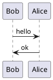

[ ] `[vim]` suggest different style for Search dark yellow for some terminal
   colorschemes, in the rare cases where the default is not readable
   `hi Search term=reverse cterm=reverse ctermfg=3 ctermbg=15`
   dark cyan background with bright white text is also generally well readable
   `hi Search term=reverse cterm=reverse ctermfg=6 ctermbg=15`

[ ] See if this can fixed, it's become very unpredictable depending on the
   terminal

       " Close quickfix list with escape
       if has('localmap')
         autocmd FileType qf nnoremap <buffer> <silent> <Esc> :<c-u> cclose<CR>
       endif

[ ] Reconsider these shortcuts

       " Set folding to leader-L
       " zr to unfold and zm to fold. zR to unfold all and zM to fold all
       nmap <Leader>l :set foldmethod=syntax<CR>

       " Remap jj to escape insert mode
       inoremap jj <ESC>

Interesting .vimrc files
------------------------

* <https://github.com/nickjj/dotfiles/blob/master/.vimrc>
* <https://github.com/bryankennedy/vimrc/blob/master/vimrc>

.vimrc.after customisations
---------------------------

    " let g:ale_linters = {'go': ['golangci-lint', 'govet']}
    " let g:ale_linters = {'go': ['gopls']}
    " let g:ale_linters = {'go': ['staticcheck', 'govet']}
    " let g:ale_linters = {'go': ['staticcheck']}
    let g:ale_linters = {'go': ['govet']}
    let g:ale_go_golangci_lint_options = '' " only use defaults
    let g:ale_go_govet_options = '-composites=false'
    let g:go_fmt_options = {
    \  'gofmt': '-s',
    \  'goimports': '-local bitbucket.glintpay.com -local glint-backend',
    \}

    " let g:go_gopls_local = 'glint-backend'
    " let g:go_gopls_local = 'bitbucket.glintpay.com'
    let g:go_gopls_local = {
    \  $HOME.'/go/src/some-project-in-gopath': 'some-project-in-gopath',
    \  $HOME.'/go/src/another-project-in-gopath': 'another-project-in-gopath',
    \  $HOME.'/myprojects/project-abc': 'bitbucket.foobar.com',
    \  $HOME.'/myprojects/project-xyz': 'bitbucket.foobar.com',
    \}

Other plugins
-------------

TODO: move language specific plugins and configuration to separate vimrc
files to be loaded conditionally via a vimrc.before and vimrc.after mechanism

### TypeScript

    " ...syntax
    Plug 'HerringtonDarkholme/yats.vim'
    " ...dev tools (TSServer client)
    Plug 'Quramy/tsuquyomi'

### Statusline

    Plug 'vim-airline/vim-airline'
    Plug 'vim-airline/vim-airline-themes'

### Miscellanea

    Plug 'dhruvasagar/vim-table-mode'

    " Reveal syntax highlighting group under the cursor
    Plug 'gerw/vim-HiLinkTrace'

    Plug 'keith/swift.vim'
    Plug 'mustache/vim-mustache-handlebars'
    Plug 'rodjek/vim-puppet'
    Plug 'udalov/kotlin-vim'
    Plug 'kchmck/vim-coffee-script'
    Plug 'posva/vim-vue'
    Plug 'vim-syntastic/syntastic'
    Plug 'mxw/vim-jsx'
    Plug 'mileszs/ack.vim'

Markdown plugins
-----------------

### Markdown preview

* <https://github.com/greyblake/vim-preview>
* <https://github.com/previm/previm/blob/master/README-en.mkd>
* <https://github.com/suan/vim-instant-markdown>

### Markdown syntax

* <https://github.com/gabrielelana/vim-markdown>, for GitHub-flavoured markdown
* <https://github.com/plasticboy/vim-markdown>
* <https://github.com/rhysd/vim-gfm-syntax>

### Plasticboy's Markdown config

This plugin has much better syntax highlighting, but it messes with
auto-formatting in several ways, to the point of becoming unusable.

    Plug 'godlygeek/tabular'
    Plug 'plasticboy/vim-markdown'

    let g:vim_markdown_folding_disabled = 1
    let g:vim_markdown_no_default_key_mappings = 1
    let g:vim_markdown_toc_autofit = 1
    let g:vim_markdown_conceal = 0
    let g:vim_markdown_conceal_code_blocks = 0
    let g:vim_markdown_new_list_item_indent = 0
    " we cannot disable auto-bullets because it breaks formatlistpat
    " let g:vim_markdown_auto_insert_bullets = 0

PlantUML
--------

* <https://github.com/aklt/plantuml-syntax> also adds a make target, so the PNG
  can be generated directly with `:Make` from inside a `.puml` file.

* <https://github.com/weirongxu/plantuml-previewer.vim> would be ideal, but it
  does not seem to generate the images

  <https://github.com/weirongxu/plantuml-previewer.vim/issues/40>.

  if it worked, this would be the only one to support real time previews of
  standalone `.puml` files.

        Plug 'tyru/open-browser.vim'
        Plug 'weirongxu/plantuml-previewer.vim'

        " point to the correct plantuml.jar (as per readme)
        " https://github.com/weirongxu/plantuml-previewer.vim#gplantuml_previewerplantuml_jar_path
        "
        " in shell:
        "
        "     cat `which plantuml` | grep plantuml.jar | sed -r 's/^.+\s{1}(\S+plantuml.jar).*/\1/'

        au FileType plantuml let g:plantuml_previewer#plantuml_jar_path = get(
            \  matchlist(system('cat `which plantuml` | grep plantuml.jar'), '\v.*\s[''"]?(\S+plantuml\.jar).*'),
            \  1,
            \  0
            \)

        " the preview server and the images default to the directory of the plugin
        " itself, but can be customised
        " let g:plantuml_previewer#viewer_path = $HOME . "/.plantuml-previews"

* <https://github.com/iamcco/markdown-preview.nvim> works well, but only for
  PlantUML embedded in markdown files, inside fenced blocks marked as
  `plantuml`.

* <https://github.com/previm/previm> Previm is an alternative to
  `markdown-preview.nvim`, works similarly, based on Node.js, but it doesn't
  provide instant rendering nor automatic scrolling. It supports PlantUML and
  other graphical formats.

* <https://github.com/scrooloose/vim-slumlord> is from the same author of
  NERDTree, and it adds an ASCII art render of the current `.puml` file. The
  readme says that it works well for sequence diagrams, less for other types
  (and in fact PlantUML seems to throw exceptions for some state machine
  diagrams).

* <https://github.com/skanehira/preview-uml.vim> uses the official PlantUML
  server, preferably running in Docker, again to render in ASCII art format.
  Presumably having the same issues as with `vim-slumlord`.

NERDTree alternatives
---------------------

* <http://vimcasts.org/blog/2013/01/oil-and-vinegar-split-windows-and-project-drawer/>
* <https://github.com/tpope/vim-vinegar>
* <https://github.com/lambdalisue/fern.vim>

Alternate JSON formatting, doesn't respect order
------------------------------------------------

    autocmd FileType json command! -nargs=0 Format execute ':%! python -c "import sys, json; print json.dumps(json.load(sys.stdin), indent=2)"'

Hide the '[No Name]' buffer
---------------------------

  let g:airline#extensions#tabline#excludes = []

Other colorschemes
------------------

to derive the technique from, in order to create a Tango-like 16-color scheme.

* `dark_minimal`
* `solarized`
* `onedark`
* `term`
* `term_light`
* `tomorrow` => this is interesting because it takes the color from the syntax
  highlighting groups
* `monochrome`

Async search
-------------

Our main requirements for search are:

* do one thing well (we still want it to work like Vim)
* must populate the quickfix list (to support global search+replace with cfdo)
* has to be asynchronous because Ack freezes the UI on large-ish directories,
  even with the fastest search backends like ripgrep

Alternative solutions are

* **Ack** <https://github.com/mileszs/ack.vim> in conjunction with Dispatch
  <https://github.com/tpope/vim-dispatch>, which however requires tmux. Ack
  sadly has no plans to support async operation natively.

* **CtrlSF** <https://github.com/dyng/ctrlsf.vim> the most popular. It works
  very well and it can be configured to work and appear just like Ack, but
  although it does populate the quickfix list with the results, it shows the
  results in a custom type of buffer. This could be an advantage because it
  would leave the quickfix window free for otherpurposes, but for now
  maintaining full feature parity with the existing Ack setup was a priority.

* **vim-esearch** <https://github.com/eugen0329/vim-esearch> is very powerful
  but overfeatured (the popup overlay in particular)

* **agrep** <https://github.com/ramele/agrep> similar to CtrlSF, doesn't seem
  to offer any advantage over it.

* **FlyGrep** <https://github.com/wsdjeg/FlyGrep.vim> it's a part of the
  SpaceVim distro also available as a stand-alone plugin.

* **fzf.vim** <https://github.com/junegunn/fzf.vim> although it's capable of
  populating the quickfix by pressing a sequence of shortcuts, it's
  a completely different concept, it doesn't load the results in a buffer, it
  shows them in real time in a terminal window. Text search is a different use
  case than file search, we want to keep the results visible until we close
  them explicitly, and we want to populate the quickfix automatically.

* **Ferret** <https://github.com/wincent/ferret> looks very nice but again
  overfeatured

Get info about the window of the current buffer
-----------------------------------------------

* BAD

    function! GetCurrentWininfo()
      let l:qf_win_nr = winnr()
      let l:qf_win_info = {}

      for win_info in getwininfo()
        if win_info.winnr == l:qf_win_nr
          let l:qf_win_info = win_info
          break
        endif
      endfor

      return l:qf_win_info
    endfunction

* GOOD

    getwininfo(win_getid())[0].loclist != 1

Support for other Vim plugins
-----------------------------

### rainbow-pairs

    let g:rainbow#max_level = 16
    let g:rainbow#pairs = [['(', ')'], ['[', ']'],['{', '}']]

### Syntastic

    let g:syntastic_javascript_checkers=['eslint']
    " let g:syntastic_go_checkers=['go']

    " let g:syntastic_mode_map = { 'mode': 'active', 'passive_filetypes': ['go'] }
    let g:syntastic_mode_map = { 'mode': 'passive' }
    let g:syntastic_always_populate_loc_list=1
    let g:syntastic_auto_loc_list = 1

### CtrlSF

    " no need to specify the search tool (a.k.a. backend), there are sensible
    " defaults, preferring rg and then ag if available, see ':help g:ctrlsf_backend'
    " if executable('rg')
    "   let g:ctrlsf_backend = 'rg'
    " elseif executable('ag')
    "   let g:ctrlsf_backend = 'ag'
    " endif

    let g:ctrlsf_default_view_mode = 'compact'
    let g:ctrlsf_populate_qflist = 1
    let g:ctrlsf_regex_pattern = 1
    let g:ctrlsf_position = 'bottom'
    let g:ctrlsf_winsize = '100'

    let g:ctrlsf_extra_backend_args = {
    \  'rg': s:rgdefaults,
    \}

    " CtrlSF seems to force the handling of ignores internally, so `--glob='!...'`
    " patterns will be ignored. The only way to set up ignores is to add them to
    " this list
    let g:ctrlsf_ignore_dir = ['.git']
    let g:ctrlsf_auto_close = {'normal' : 0, 'compact': 0}

### Ack

    if executable('rg')
      let g:ackprg = s:rg_base_grepprg
    elseif executable('ag')
      let g:ackprg = 'ag --hidden --follow --smart-case --skip-vcs-ignores' . s:agignore
    endif
    " do no jump to the first result
    cnoreabbrev Ack Ack!
    nnoremap <Leader>a :Ack!<Space>
    " highlight the searched term
    let g:ackhighlight = 1

    " Search for visual selection (rudimental, only works in basic scenarios)
    vnoremap <Leader>a y:Ack <C-r>=GetShellEscapedVisual()<CR>

    " Run in the background with the help of tpope/vim-dispatch
    " only appears to work in tmux
    if $TMUX != ""
      let g:ack_use_dispatch = 1
    endif

### vim-dispatch

    " don't create shortcuts, as this is only installed to support Ack's
    " asynchronous behaviour
    let g:dispatch_no_maps = 1

### tpope/vim-markdown

    " Vim has a built-in markdown plugin (tpope/vim-markdown), but its syntax
    " highligting is basic in terms of styles, and does not support several valid
    " markdown features
    "
    " to activate it:
    autocmd BufNewFile,BufReadPost *.md set filetype=markdown

    " treat .txt files as markdown
    autocmd BufNewFile,BufReadPost *.txt set filetype=markdown

    its options are the following:

    let g:markdown_fenced_languages = ['html', 'python', 'bash=sh']
    let g:markdown_fenced_languages = [
    \  'go',
    \  'ruby',
    \  'bash=sh',
    \  'zsh',
    \  'plantuml',
    \  'python',
    \  'json',
    \  'yaml',
    \  'vim',
    \]
    let g:markdown_syntax_conceal = 0
    let g:markdown_minlines = 100

### vim-go

    " gofumports is not actually a drop-in replacement for goimports, sometimes it
    " won't be able to add local packages automatically
    let g:go_fmt_command = 'gofumports'
    let g:go_imports_mode = 'goimports'
    " let g:go_diagnostics_enabled = 1 " we can A.L.E. for this
    let g:go_gopls_staticcheck = v:true
    let $GINKGO_EDITOR_INTEGRATION = 'true'

    let g:go_addtags_transform = 'camelcase'
    let g:go_addtags_transform = 'snake_case'

    " highlight current identifier
    let g:go_auto_sameids = 1

### Airline

    " Airline is included despite of how heavily it clutters the UI, for a few
    " reasons...
    "
    " * it's hugely popular
    " * it provides a 'tab bar' functionality, which is considered useful for users
    "   coming from GUI editors; this works really well and can be displayed with
    "   the custom :ToggleTablineWithBuffers command
    " * some parts of the status bar are actually helpful (in particular the Vim
    "   mode and how it's formatted)
    "
    " However, to prevent a cognitive overload, it's been heavily streamlined.

    set noshowmode " showing the Vim mode twice is ugly

    let g:airline_theme = 'base16_default' " Milder colorscheme (pending the creation of a true 16-color colorscheme)

    let g:airline_symbols_ascii = 1

    " --- tabline --- "

    let g:airline#extensions#tabline#enabled = 1 " Enable the list of buffers
    let g:airline#extensions#tabline#fnamemod = ':t' " Show just the filename
    let g:airline#extensions#tabline#buffer_nr_show = 1 " Show buffer number in status bar
    au VimEnter * :set showtabline=0 " Keep the tabline hidden by default
    function! s:ToggleTablineWithBuffers()
      if &showtabline
        set showtabline=0
      else
        set showtabline=2
      end
    endfunction

    if !exists(":ToggleTablineWithBuffers")
      command ToggleTablineWithBuffers call <SID>ToggleTablineWithBuffers()
    endif

    " --- Streamline the status bar

    " More extensions might need to be disabled if additional plugins are installed
    " and have a correspoding builtin extension.
    "
    " Run :AirlineExtensions to find which are enabled.

    " the built-in quickfix extension is lightweight and we can leave it on
    " let g:airline#extensions#quickfix#enabled = 0

    " unfortunately tagbar, because it's not asynchronous, can make this extension
    " quite slow, delaying the painting of the status bar
    let g:airline#extensions#tagbar#enabled = 0

    " other resource-intensive extensions are all better disabled
    let g:airline#extensions#branch#enabled = 0
    let g:airline#extensions#fugitiveline#enabled = 0
    let g:airline#extensions#fzf#enabled = 0
    let g:airline#extensions#keymap#enabled = 0
    let g:airline#extensions#netrw#enabled = 0
    let g:airline#extensions#po#enabled = 0
    let g:airline#extensions#searchcount#enabled = 0
    let g:airline#extensions#syntastic#enabled = 0
    let g:airline#extensions#term#enabled = 0
    let g:airline#extensions#whitespace#enabled = 0
    let g:airline#extensions#wordcount#enabled = 0
    let g:airline#extensions#ale#enabled = 0

    " customise the airline layout:
    " - remove section X (filetype)
    " - remove section Y (file encoding and fileformat)
    " - remove section B (git branch etc.)
    let g:airline#extensions#default#layout = [
      \ [ 'a', 'c' ],
      \ [ 'x', 'z', 'error', 'warning', 'statistics' ]
    \ ]

Default section definitions

    section_A = %#__accent_bold#%{airline#util#wrap(airline#parts#mode(),0)}%#__restore__#%{airline#util#append(airline#parts#crypt(),0)}%{airline#util#append(airline#parts#paste(),0)}%{airline#util#append("",0)}%{airline#util#append(airline#parts#spell(),0)}%{airline#util#append("",0)}%{airline#util#append("",0)}%{airline#util#append(airline#parts#iminsert(),0)}
    section_B = 'seems to be empty'
    section_C = %<%f%m %#__accent_red#%{airline#util#wrap(airline#parts#readonly(),0)}%#__restore__#%#__accent_bold#%#__restore__#
    section_X = %{airline#util#prepend("",0)}%{airline#util#prepend("",0)}%{airline#util#prepend("",0)}%{airline#util#prepend("",0)}%{airline#util#wrap(airline#parts#filetype(),0)}
    section_Y = %{airline#util#wrap(airline#parts#ffenc(),0)}
    section_Z = %p%% %#__accent_bold#%{g:airline_symbols.linenr}%l%#__restore__#%#__accent_bold#/%L%{g:airline_symbols.maxlinenr}%#__restore__#:%v

Golang/Neovim setup for LSP
---------------------------

    if !has('nvim')
      Plug 'fatih/vim-go', { 'do': ':GoInstallBinaries' }
    endif

    if has('nvim')
      " requires Neovim 0.5+
      Plug 'neovim/nvim-lspconfig'
    endif

    if !has('nvim')
      Plug 'dense-analysis/ale'
    endif

    if has('nvim')
    lua <<EOF
      nvim_lsp = require "nvim_lsp"
      nvim_lsp.gopls.setup {
        cmd = {"gopls", "serve"},
        settings = {
          gopls = {
            analyses = {
              unusedparams = true,
            },
            staticcheck = true,
          },
        },
      }

      function goimports(timeoutms)
        local context = { source = { organizeImports = true } }
        vim.validate { context = { context, "t", true } }

        local params = vim.lsp.util.make_range_params()
        params.context = context

        local method = "textDocument/codeAction"
        local resp = vim.lsp.buf_request_sync(0, method, params, timeoutms)
        if resp and resp[1] then
          local result = resp[1].result
          if result and result[1] then
            local edit = result[1].edit
            vim.lsp.util.apply_workspace_edit(edit)
          end
        end

        vim.lsp.buf.formatting()
      end
    EOF

    "  local nvim_lsp = require 'nvim_lsp'
    "  nvim_lsp.gopls.setup{
    "    cmd = {"gopls"};
    "    filetypes = {"go"};
    "    root_dir = nvim_lsp.util.root_pattern('go.mod', '.git');
    "    log_level = vim.lsp.protocol.MessageType.Log;
    "    settings = {}
    "  }

    autocmd BufWritePre *.go lua goimports(1000)
    nnoremap <silent> gd <cmd>lua vim.lsp.buf.definition()<CR>

    autocmd Filetype go setlocal omnifunc=v:lua.vim.lsp.omnifunc
    endif

Brew packages to be reviewed
----------------------------

* binutils
* ed
* gdb
* unzip
* sqlite
